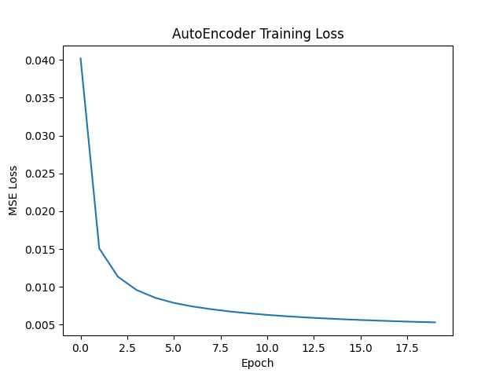
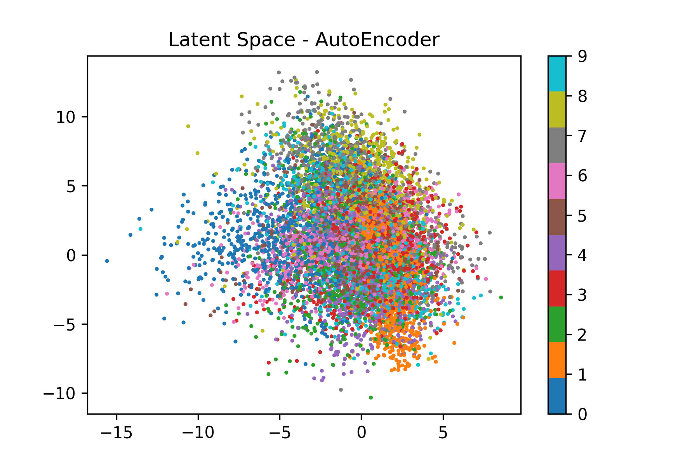
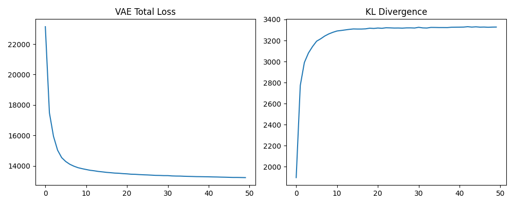
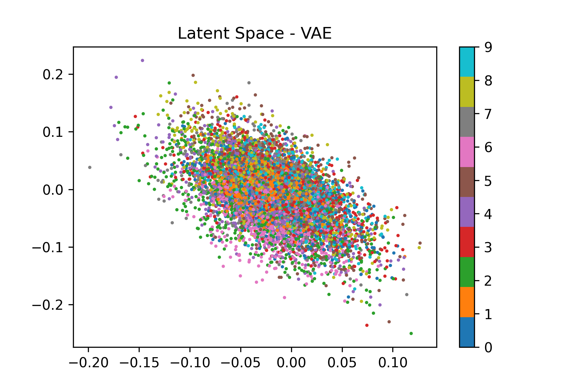
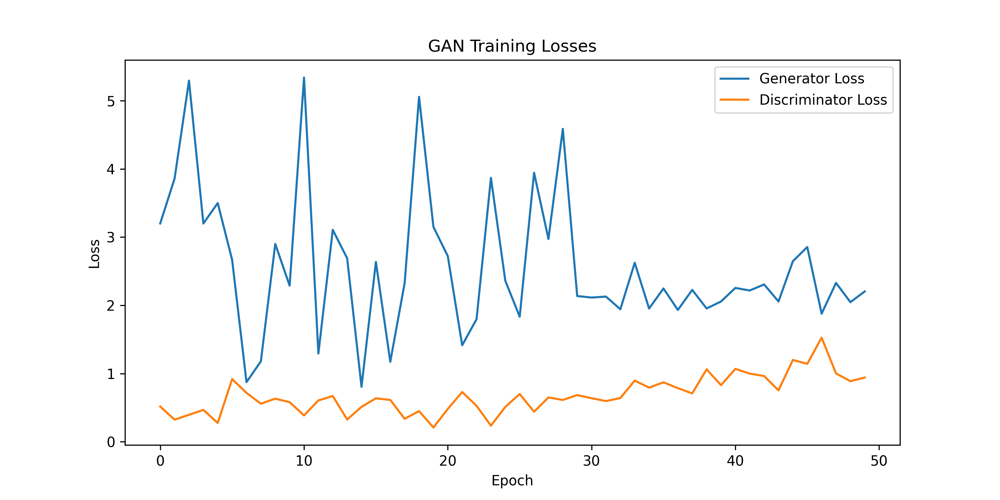
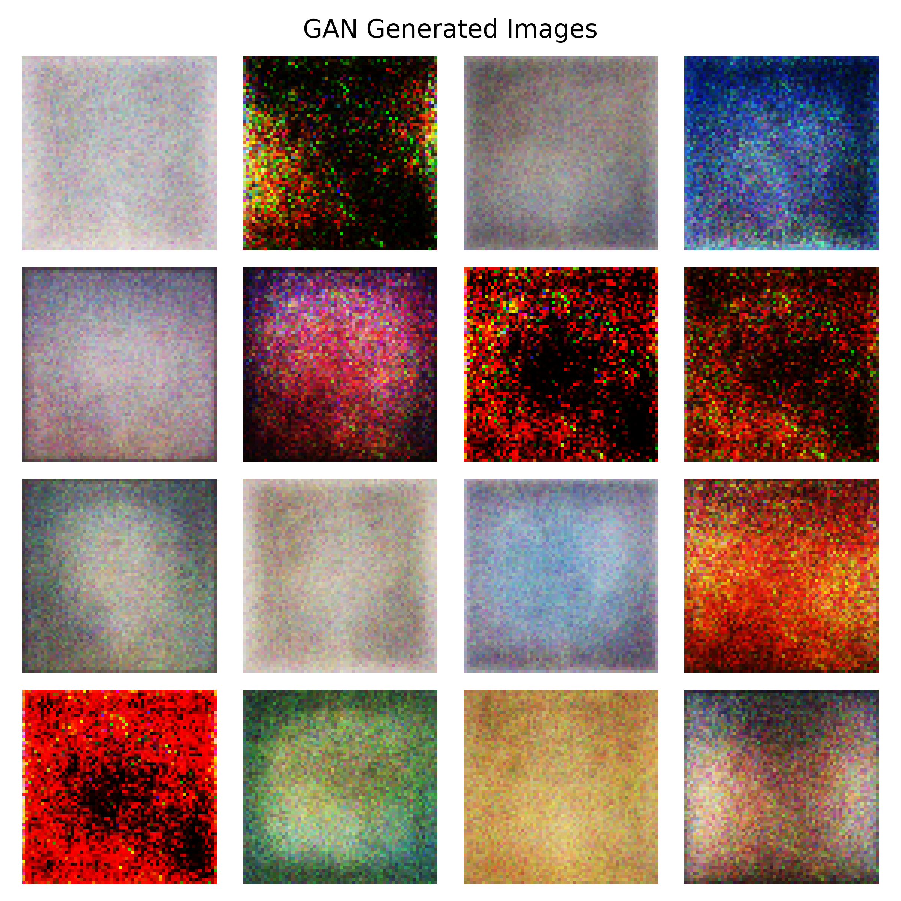

# Deep Learning Lab 4 – Deep Generative Models with PyTorch

**Abdelmalek Essaadi University**  
**Faculty of Sciences and Techniques of Tangier**  
**Computer Engineering Department – Master SITBD**  
**Module:** Deep Learning  
**Professor:** Pr. ELAACHAK LOTFI  
**Student:** ABABRI Chaimae  

---

## Objective of the Lab

The objective of this lab is to understand and implement deep generative models using PyTorch.  
The focus is on learning data distributions and generating new samples without supervision.

Three generative models are studied:
- Autoencoder (AE)
- Variational Autoencoder (VAE)
- Generative Adversarial Network (GAN)

---

## Tools and Environment

- Python
- PyTorch & Torchvision
- Kaggle Notebook
- Matplotlib
- GitHub

---

## Part 1: Autoencoder (AE) and Variational Autoencoder (VAE)

### Autoencoder Architecture

The Autoencoder consists of:
- An encoder that compresses the input image into a low-dimensional latent space
- A decoder that reconstructs the image from the latent representation

The model is trained using Mean Squared Error (MSE) loss.

#### Hyperparameters
- Latent dimension: 32
- Optimizer: Adam
- Learning rate: 0.001
- Batch size: 128
- Epochs: 20

---

### Autoencoder Results

The training loss decreases steadily during training:

- Initial loss: ~0.040
- Final loss: ~0.0054

This indicates that the model successfully learns to reconstruct the input images.

Visually, the reconstructed digits are sharp and very similar to the original MNIST images.

**Conclusion (AE):**  
The Autoencoder performs well in image reconstruction but does not enforce any structure on the latent space.

---

### Variational Autoencoder (VAE)

The Variational Autoencoder introduces a probabilistic latent space.  
The encoder outputs:
- Mean (μ)
- Log-variance (log σ²)

The loss function is composed of:
- Reconstruction loss
- KL divergence regularization

#### Hyperparameters
- Latent dimension: 32
- Optimizer: Adam
- Learning rate: 0.001
- Batch size: 128
- Epochs: 20

---

### VAE Results

Observed training behavior:
- Total loss decreases from ~22610 to ~13497
- KL divergence increases and stabilizes around ~3360

The reconstructed images are smoother than those of the AutoEncoder.

**Conclusion (VAE):**  
The KL divergence enforces a structured and continuous latent space, making the VAE more suitable for generation and interpolation, at the cost of slightly blurrier reconstructions.

---

### Comparison: AE vs VAE

| Model | Reconstruction Quality | Latent Space | Generative Ability |
|------|------------------------|--------------|-------------------|
| AE   | High                   | Unstructured | Limited           |
| VAE  | Moderate               | Structured   | Strong            |

---

## Part 2: Generative Adversarial Networks (GANs)

### GAN Architecture

The GAN consists of:
- Generator: transforms random noise into images
- Discriminator: classifies images as real or fake

Loss function:
- Binary Cross-Entropy Loss (BCE)

#### Hyperparameters
- Latent dimension: 100
- Optimizer: Adam
- Learning rate: 0.0002
- Batch size: 64
- Epochs: 50

---

### GAN Training Results

During training:
- Discriminator loss oscillates between ~0.2 and ~1.0
- Generator loss fluctuates between ~1.5 and ~6.0, with occasional spikes

This oscillatory behavior is expected in GAN training due to the adversarial optimization process.

---

### Generated Images Analysis

The generated images show:
- Coherent color distributions
- Smooth abstract textures
- Global similarity to the original dataset

However:
- Fine details remain blurry
- Some samples lack diversity

These limitations are expected due to the simple GAN architecture and limited resolution.

---

## Brief Synthesis

Through this lab, I gained a practical understanding of generative models, particularly AutoEncoders, Variational AutoEncoders (VAE), and Generative Adversarial Networks (GANs).

I learned how AutoEncoders compress data into a latent representation and how VAEs improve this process by enforcing a structured and continuous latent space using KL divergence. Visualizing the latent space helped me understand how data distributions are learned internally by the models.

By implementing GANs, I understood the adversarial training process between a generator and a discriminator, and how their losses evolve during training. I also observed the instability of GAN training and the importance of balancing both networks.
